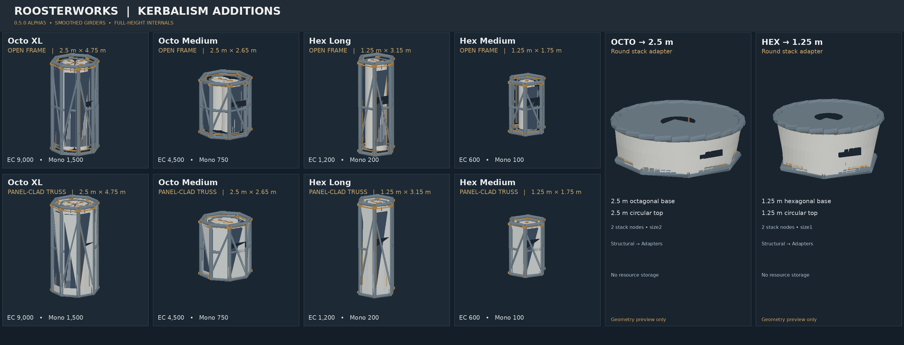

# RoosterWorks Kerbalism Additions

**Version:** 0.5.0-alpha5 (experimental KSP1 prototype)  
**Author:** SockedRooster · **License:** MIT © 2026 SockedRooster  
**Repository:** https://github.com/SockedRooster/RoosterWorks-Kerbalism-Additions

*The illustration above is generated from original model geometry, not an in-game screenshot.*

## About

Six original RoosterWorks parts for KSP1: four structural Support girders with built-in Monopropellant pressure tanks and fixed ElectricCharge storage, plus two structural stack adapters. No Near Future Construction model, texture, or code is bundled.

## Structural variants

Every girder has a **stock Part Variants** selector in the VAB:

- **Open Frame** — thick structural rails with exposed full-height propellant tanks and battery packs mounted flush to the inside of the polygon faces.
- **Armored Panels** (*panel-clad truss*) — continuous full-height plating from end ring to end ring, leaving the external beams and joints visible.

Both variants have identical resource capacities, mass, cost, attachments and fixed colliders. Panels are cosmetic, without their own collider. There is no B9 dependency.

## Parts

| Part | Diameter | Length | ElectricCharge | MonoPropellant |
| --- | ---: | ---: | ---: | ---: |
| Octo Support Girder XL | 2.5 m | 4.75 m | 9,000 | 1,500 |
| Octo Support Girder Medium | 2.5 m | 2.65 m | 4,500 | 750 |
| Hex Support Girder Long | 1.25 m | 3.15 m | 1,200 | 200 |
| Hex Support Girder Medium | 1.25 m | 1.75 m | 600 | 100 |
| Octo → round 2.5 m adapter | 2.5 m | 0.74 m | — | — |
| Hex → round 1.25 m adapter | 1.25 m | 0.56 m | — | — |

The adapters are fixed structural converters with **top and bottom stack nodes** (size2 on the Octo adapter, size1 on the Hex adapter), not docking ports. They store no resources.

## Requirements and editor

- Designed for **KSP 1.12.5**. Requires no plugin DLL, Blender, B9 Part Switch, ModuleManager, or Near Future Construction.
- Girders appear under **Structural** (or **Structural → Trusses** with VAB Organizer).
- Adapters appear under **Structural** (or **Structural → Adapters** with VAB Organizer).
- Octo girders and adapter unlock at **Specialized Construction**; Hex girders and adapter unlock at **Advanced Construction**.
- Kerbalism is optional for loading parts, but recommended for validating the intended persistent-storage behavior.

## Installation

1. Quit KSP and back up your saves.
2. Delete any previous `GameData/RoosterWorksKerbalismAdditions` folder rather than merging test builds.
3. Extract `RoosterWorks-Kerbalism-Additions-v0.5.0-alpha5.zip` into the **KSP installation root**.
4. Start KSP and find the parts under Structural.

**Existing crafts:** The four girder IDs and original Octo adapter ID are unchanged from v0.2.0. New Hex adapter ID: `RW_Hex125_Adapter`.

## Kerbalism / persistence design

ElectricCharge and MonoPropellant are declared as permanent, direct stock `RESOURCE` nodes in each girder part. The parts contain **no B9 resource switching**; switching the exterior armor does not change storage. The models represent tanks, battery housings, and cables visually, but do not generate power or fuel.

Live persistence across background simulation, time warp, reloading, and vessel switching **still requires in-game testing**. The source validates structure, not runtime physics.

## Alpha validation checklist

- Confirm the six parts load and both adapters attach on both ends.
- Verify Open Frame and Armored Panels render, change cleanly, and survive save/reload.
- Check the RoosterWorks labels for upright, readable text; this version flips both texture axes to address previous mirrored labeling.
- Inspect the smoother round truss tubes, higher-quality textures, and green LED battery details; verify the rails no longer read as hollow channels.
- Check stack collision in a disposable sandbox save.
- Confirm EC and MonoPropellant remain intact after craft loading, time warp, vessel switching, and Kerbalism background simulation.

## Source and license

Models, textures, configs and their Python asset generator are original RoosterWorks work under [MIT](LICENSE). Source: [`Source/build.py`](Source/build.py), [`Source/render_preview.py`](Source/render_preview.py), [`Source/test_assets.py`](Source/test_assets.py).

**Do not publish this alpha as a stable CKAN release before live testing.**
